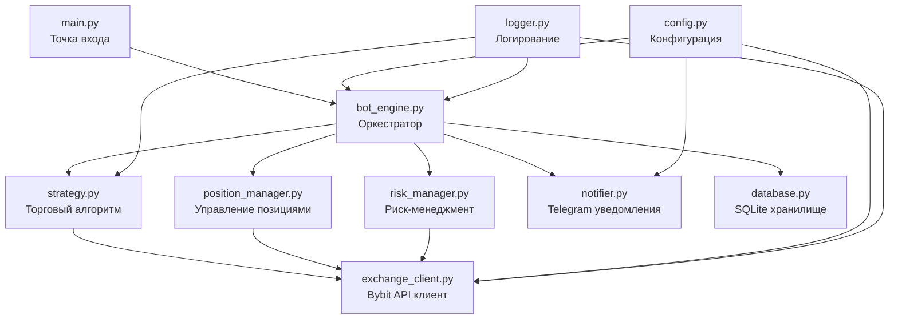

# 🏗️ Архитектура проекта — Бот Криптотрейдер

**Версия**: 1.0  
**Дата**: 04.03.2026  
**Основание**: [ТЗ](file:///c:/Users/admin/Desktop/Бот%20криптотрейдер/2_technical_spec/tz.md)

---

## 1. Технологический стек

| Слой | Технология | Обоснование |
|---|---|---|
| **Язык** | Python 3.11+ | Богатая экосистема для трейдинга, asyncio для WebSocket |
| **Bybit API** | pybit (официальный SDK) | Официальная библиотека Bybit, поддержка v5 API |
| **WebSocket** | websockets / pybit WS | Получение цены в реальном времени |
| **Телеграм** | python-telegram-bot | Уведомления, простой и надёжный |
| **Конфигурация** | python-dotenv + JSON | `.env` для секретов, `config.json` для стратегии |
| **Логирование** | logging (стандартная) | Ротация файлов, уровни логирования |
| **БД (сделки)** | SQLite | Лёгкая, без сервера, хватает для MVP |
| **Планировщик** | APScheduler | Ежедневная сводка, периодические задачи |
| **Тестирование** | pytest + pytest-asyncio | Юнит-тесты, асинхронные тесты |

> **Почему Python?**
> - Официальный SDK Bybit (`pybit`) — на Python
> - Нативная поддержка asyncio для WebSocket-потоков
> - Быстрая разработка и прототипирование
> - Огромное количество библиотек для трейдинга (ta-lib, pandas)
> - Низкий порог входа для будущих контрибьюторов

---

## 2. Высокоуровневая архитектура

```
┌─────────────────────────────────────────────────────────────────┐
│                        CRYPTO TRADER BOT                        │
├─────────────────────────────────────────────────────────────────┤
│                                                                 │
│  ┌──────────┐    ┌──────────────┐    ┌───────────────────┐     │
│  │  main.py │───►│  Bot Engine   │───►│  Trading Strategy │     │
│  │ (точка   │    │ (оркестратор)│    │  (алгоритм)       │     │
│  │  входа)  │    └──────┬───────┘    └────────┬──────────┘     │
│  └──────────┘           │                     │                 │
│                         │                     │                 │
│              ┌──────────┼─────────────────────┤                 │
│              │          │                     │                 │
│              ▼          ▼                     ▼                 │
│  ┌───────────────┐ ┌──────────┐  ┌──────────────────────┐     │
│  │ Risk Manager  │ │ Bybit    │  │ Position Manager     │     │
│  │ (контроль     │ │ Client   │  │ (управление          │     │
│  │  рисков)      │ │ (API)    │  │  позициями)          │     │
│  └───────────────┘ └────┬─────┘  └──────────────────────┘     │
│                         │                                       │
│              ┌──────────┼──────────┐                            │
│              ▼          ▼          ▼                            │
│  ┌──────────────┐ ┌─────────┐ ┌──────────────┐                │
│  │ Notifier     │ │ Logger  │ │ Database     │                │
│  │ (Telegram)   │ │ (логи)  │ │ (SQLite)     │                │
│  └──────────────┘ └─────────┘ └──────────────┘                │
│                                                                 │
├─────────────────────────────────────────────────────────────────┤
│              .env  +  config.json  (конфигурация)               │
└─────────────────────────────────────────────────────────────────┘
         │                                    ▲
         ▼                                    │
┌──────────────┐                    ┌─────────────────┐
│  Bybit API   │◄──── REST/WSS ───►│  Telegram API   │
│  (биржа)     │                    │  (уведомления)  │
└──────────────┘                    └─────────────────┘
```

---

## 3. Модульная архитектура

### 3.1 Модули и их ответственность



### 3.2 Описание модулей

| Модуль | Файл | Ответственность |
|---|---|---|
| **Точка входа** | `main.py` | Парсинг аргументов, инициализация, запуск event loop, graceful shutdown |
| **Оркестратор** | `bot_engine.py` | Координация всех модулей, основной цикл работы, обработка событий |
| **Торговый алгоритм** | `strategy.py` | Анализ цены, генерация сигналов на вход, расчёт тейк-профита |
| **Управление позициями** | `position_manager.py` | Открытие/закрытие позиций, усреднение, расчёт средней цены |
| **Риск-менеджмент** | `risk_manager.py` | Проверки перед входом: ликвидация, объём, лимит входов |
| **Bybit клиент** | `exchange_client.py` | REST API + WebSocket, размещение ордеров, получение данных |
| **Уведомления** | `notifier.py` | Отправка сообщений в Telegram, форматирование |
| **База данных** | `database.py` | CRUD для сделок, история, статистика |
| **Конфигурация** | `config.py` | Загрузка `.env` + `config.json`, валидация параметров |
| **Логирование** | `logger.py` | Настройка логгера, ротация файлов, форматирование |

---

## 4. Потоки данных

### 4.1 Основной торговый цикл

```
                    ┌─────────────────────────┐
                    │    WebSocket Stream      │
                    │  (цена ETH/USDT)         │
                    └────────────┬────────────┘
                                 │
                                 ▼
                    ┌─────────────────────────┐
                    │    Strategy              │
                    │  Анализ цены             │
                    │  Расчёт индикатора       │
                    └────────────┬────────────┘
                                 │
                          Сигнал на вход?
                         /              \
                       Нет              Да
                        │                │
                        ▼                ▼
                    Ожидание    ┌──────────────────┐
                                │  Risk Manager     │
                                │  ✓ Входов < 5?    │
                                │  ✓ Объём ≤ баланс?│
                                │  ✓ Нет ликвидации?│
                                └────────┬─────────┘
                                         │
                                  Проверки пройдены?
                                 /              \
                               Нет              Да
                                │                │
                                ▼                ▼
                           Лог причины  ┌──────────────────┐
                           отказа       │ Position Manager  │
                                        │ Открыть BUY-ордер│
                                        │ Пересчёт средней │
                                        │ Установить TP     │
                                        └────────┬─────────┘
                                                 │
                                    ┌────────────┼────────────┐
                                    ▼            ▼            ▼
                               ┌────────┐  ┌─────────┐  ┌────────┐
                               │Database│  │Notifier │  │ Logger │
                               │Сохра-  │  │Telegram │  │Файл    │
                               │нить    │  │уведом-  │  │логов   │
                               │сделку  │  │ление    │  │        │
                               └────────┘  └─────────┘  └────────┘
```

### 4.2 Цикл фиксации прибыли

```
   Текущая цена ≥ Средняя цена входа × 1.01 (тейк-профит +1%)
                         │
                         ▼
              ┌─────────────────────┐
              │  Position Manager    │
              │  SELL (reduce only)  │
              │  Закрыть ВСЮ позицию│
              └──────────┬──────────┘
                         │
              ┌──────────┼──────────┐
              ▼          ▼          ▼
         ┌────────┐ ┌─────────┐ ┌────────┐
         │Database│ │Notifier │ │ Logger │
         │PnL,    │ │💰 Сделка│ │Запись  │
         │комиссия│ │закрыта  │ │        │
         └────────┘ └─────────┘ └────────┘
                         │
                         ▼
              Бот возвращается в режим
              ожидания нового сигнала
```

---

## 5. Архитектура данных

### 5.1 Схема базы данных (SQLite)

#### Таблица `trades` — история сделок

| Поле | Тип | Описание |
|---|---|---|
| `id` | INTEGER PK | Уникальный ID сделки |
| `opened_at` | DATETIME | Время первого входа |
| `closed_at` | DATETIME | Время закрытия (NULL если открыта) |
| `symbol` | TEXT | Торговая пара (ETHUSDT) |
| `side` | TEXT | Направление (Buy) |
| `status` | TEXT | open / closed |
| `entries_count` | INTEGER | Количество входов (1–5) |
| `avg_entry_price` | REAL | Средняя цена входа |
| `exit_price` | REAL | Цена выхода (NULL если открыта) |
| `total_qty` | REAL | Общий объём позиции |
| `leverage` | INTEGER | Кредитное плечо |
| `pnl` | REAL | Прибыль/убыток (NULL если открыта) |
| `commission` | REAL | Комиссия |
| `net_pnl` | REAL | Чистый PnL (pnl - commission) |

#### Таблица `entries` — отдельные входы в позицию

| Поле | Тип | Описание |
|---|---|---|
| `id` | INTEGER PK | Уникальный ID входа |
| `trade_id` | INTEGER FK | Ссылка на сделку |
| `entry_number` | INTEGER | Номер входа (1–5) |
| `timestamp` | DATETIME | Время входа |
| `price` | REAL | Цена входа |
| `qty` | REAL | Объём входа |
| `order_id` | TEXT | ID ордера на бирже |

#### Таблица `daily_stats` — дневная статистика

| Поле | Тип | Описание |
|---|---|---|
| `id` | INTEGER PK | ID записи |
| `date` | DATE | Дата |
| `trades_closed` | INTEGER | Закрыто сделок |
| `total_pnl` | REAL | Общий PnL за день |
| `total_commission` | REAL | Комиссии за день |
| `balance` | REAL | Баланс на конец дня |

#### Таблица `bot_state` — состояние бота (для восстановления)

| Поле | Тип | Описание |
|---|---|---|
| `key` | TEXT PK | Ключ параметра |
| `value` | TEXT | Значение (JSON) |
| `updated_at` | DATETIME | Время обновления |

---

## 6. Взаимодействие с внешними API

### 6.1 Bybit REST API v5

| Действие | Эндпоинт | Метод |
|---|---|---|
| Получить баланс | `/v5/account/wallet-balance` | GET |
| Информация о позиции | `/v5/position/list` | GET |
| Разместить ордер | `/v5/order/create` | POST |
| Отменить ордер | `/v5/order/cancel` | POST |
| Установить плечо | `/v5/position/set-leverage` | POST |
| Информация об API-ключе | `/v5/user/query-api` | GET |
| Цена ликвидации | Рассчитывается из позиции | — |

### 6.2 Bybit WebSocket (публичный)

| Канал | Данные | Назначение |
|---|---|---|
| `tickers.ETHUSDT` | Последняя цена, объём, изменение | Мониторинг цены в реальном времени |
| `kline.1.ETHUSDT` | Свечи 1 мин | Расчёт индикатора для входа |

### 6.3 Bybit WebSocket (приватный)

| Канал | Данные | Назначение |
|---|---|---|
| `order` | Обновления ордеров | Отслеживание исполнения |
| `position` | Обновления позиций | Актуальное состояние позиции |
| `wallet` | Изменения баланса | Контроль баланса |

### 6.4 Telegram Bot API

| Действие | Метод | Назначение |
|---|---|---|
| Отправить сообщение | `sendMessage` | Уведомления о сделках, ошибках, сводка |

---

## 7. Конфигурация и окружение

### 7.1 Файлы конфигурации

```
.env                    — Секреты (API-ключи, токены)
config.json             — Параметры стратегии и бота
```

### 7.2 Переменные окружения (.env)

| Переменная | Описание | Обязательная |
|---|---|---|
| `BYBIT_API_KEY` | API-ключ Bybit | ✅ |
| `BYBIT_API_SECRET` | Секретный ключ Bybit | ✅ |
| `BYBIT_TESTNET` | Использовать тестнет (true/false) | ✅ |
| `TELEGRAM_BOT_TOKEN` | Токен Telegram-бота | ✅ |
| `TELEGRAM_CHAT_ID` | ID чата для уведомлений | ✅ |

### 7.3 Параметры стратегии (config.json)

| Параметр | Тип | По умолчанию | Описание |
|---|---|---|---|
| `trading.symbol` | string | "ETHUSDT" | Торговая пара |
| `trading.leverage` | int | 4 | Кредитное плечо |
| `trading.take_profit_pct` | float | 1.0 | Тейк-профит в % |
| `trading.max_entries` | int | 5 | Макс. входов |
| `trading.entry_step_pct` | float | 2.0 | Шаг усреднения в % |
| `trading.position_size_pct` | float | 5.0 | Размер позиции (% от депозита) |
| `trading.working_deposit` | float | 1000 | Рабочий депозит ($) |
| `risk.max_position_pct` | float | 95 | Макс. % от баланса в позициях |
| `risk.allow_short` | bool | false | Разрешить шорт (всегда false) |
| `bot.reconnect_attempts` | int | 10 | Попытки переподключения |
| `bot.log_level` | string | "INFO" | Уровень логирования |

---

## 8. Обработка ошибок и восстановление

### 8.1 Стратегия обработки ошибок

| Тип ошибки | Реакция | Retry |
|---|---|---|
| Разрыв WebSocket | Автоматический реконнект | До 10 попыток с экспоненциальной задержкой |
| Ошибка API (rate limit) | Пауза + retry | 3 попытки с задержкой 1–5 сек |
| Ошибка API (невалидный ордер) | Лог + Telegram-уведомление | Нет |
| Ошибка API (недостаточно средств) | Лог + Telegram + пауза | Нет (ждёт баланс) |
| Ошибка Telegram | Лог (не блокирует торговлю) | 3 попытки |
| Ошибка БД | Лог + аварийная остановка | Нет |
| Неизвестная ошибка | Лог stacktrace + Telegram | Нет |

### 8.2 Восстановление после перезапуска

```
Старт бота
    │
    ▼
Загрузка конфигурации
    │
    ▼
Подключение к Bybit API
    │
    ▼
Проверка открытых позиций на бирже ◄── КЛЮЧЕВОЙ МОМЕНТ
    │
    ├── Есть открытые позиции?
    │   │
    │   ├── Да → Загрузить состояние из БД
    │   │        Синхронизировать с биржей
    │   │        Продолжить мониторинг
    │   │
    │   └── Нет → Чистый старт
    │              Ожидание сигнала
    │
    ▼
Основной цикл работы
```

---

## 9. Безопасность

### 9.1 Многоуровневая защита

```
Уровень 1: API-ключ только на торговлю (без вывода)
    │
Уровень 2: Проверка прав ключа при старте бота
    │
Уровень 3: Только LONG-ордера (жёстко в коде)
    │
Уровень 4: Контроль объёма ≤ баланс (нет ликвидации)
    │
Уровень 5: Максимум 5 входов (жёсткий лимит)
    │
Уровень 6: .env в .gitignore (ключи не в репозитории)
    │
Уровень 7: HTTPS/WSS для всех соединений
```

---

## 10. Диаграмма компонентов

```
┌─────────────────────────────────────────────────────────────┐
│                     ВНЕШНИЕ СЕРВИСЫ                         │
│  ┌──────────────┐              ┌───────────────────┐        │
│  │  Bybit API   │              │  Telegram Bot API │        │
│  │  REST + WSS  │              │                   │        │
│  └──────┬───────┘              └────────┬──────────┘        │
└─────────┼──────────────────────────────┼────────────────────┘
          │                              │
          ▼                              ▼
┌─────────────────────────────────────────────────────────────┐
│                     ИНТЕГРАЦИИ                              │
│  ┌──────────────────┐          ┌───────────────────┐        │
│  │ exchange_client   │          │ notifier           │        │
│  │ • REST запросы    │          │ • Форматирование   │        │
│  │ • WebSocket       │          │ • Отправка в TG    │        │
│  │ • Авторизация     │          │                    │        │
│  └──────┬───────────┘          └────────┬──────────┘        │
└─────────┼──────────────────────────────┼────────────────────┘
          │                              │
          ▼                              ▼
┌─────────────────────────────────────────────────────────────┐
│                    БИЗНЕС-ЛОГИКА                            │
│  ┌────────────────┐ ┌──────────────┐ ┌────────────────┐    │
│  │ strategy        │ │position_mgr  │ │ risk_manager   │    │
│  │ • Анализ цены   │ │• Открытие    │ │• Проверка      │    │
│  │ • Индикатор     │ │• Усреднение  │ │  ликвидации    │    │
│  │ • Сигналы       │ │• Закрытие    │ │• Контроль      │    │
│  │                 │ │• Средняя цена│ │  объёма        │    │
│  └────────────────┘ └──────────────┘ └────────────────┘    │
└─────────────────────────────────────────────────────────────┘
          │
          ▼
┌─────────────────────────────────────────────────────────────┐
│                    ИНФРАСТРУКТУРА                           │
│  ┌──────────┐  ┌───────────┐  ┌─────────┐  ┌───────────┐  │
│  │ config   │  │ database  │  │ logger  │  │ bot_engine│  │
│  │ .env     │  │ SQLite    │  │ файлы   │  │ main loop │  │
│  │ JSON     │  │ trades    │  │ ротация │  │ shutdown  │  │
│  └──────────┘  └───────────┘  └─────────┘  └───────────┘  │
└─────────────────────────────────────────────────────────────┘
```

---

## 11. Принципы проектирования

| Принцип | Применение |
|---|---|
| **Single Responsibility** | Каждый модуль — одна ответственность |
| **Dependency Injection** | Модули получают зависимости при инициализации |
| **Configuration as Code** | Все параметры в конфиг-файлах, не хардкод |
| **Fail-Safe** | При ошибке — безопасное состояние (не торгуем) |
| **Idempotency** | Повторный запуск не создаёт дублей позиций |
| **Observability** | Всё логируется, всё уведомляется |
